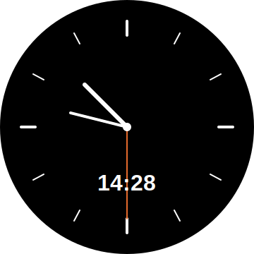
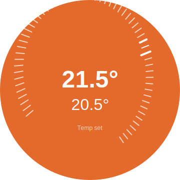

# ESP32-S3 Knob Thermostat

A smart thermostat controller built for the [Waveshare ESP32-S3-Knob-Touch-LCD-1.8](https://www.waveshare.com/wiki/ESP32-S3-Knob-Touch-LCD-1.8) that controls a Plugwise thermostat via the Homey Pro local REST API.

## Features

- **Analog Clock** - Default view showing current time (Amsterdam timezone with automatic DST)
- **Thermostat Control** - Adjust target temperature using the rotary encoder
- **Touch Navigation** - Tap screen to switch between clock and thermostat views
- **Visual Feedback** - Orange background when heating is active, black when idle
- **Debounced Updates** - 2-second delay before pushing temperature changes to prevent API spam

## Preview

<p align="center">
  
  
</p>

## Hardware

<p align="center">
  
</p>

The [Waveshare ESP32-S3-Knob-Touch-LCD-1.8](https://www.waveshare.com/wiki/ESP32-S3-Knob-Touch-LCD-1.8):

- **Display**: 1.8" 360x360 round LCD (ST77916 QSPI)
- **Input**: Rotary encoder knob + CST816 capacitive touch
- **Connectivity**: WiFi 802.11 b/g/n
- **MCU**: ESP32-S3

## Architecture

```
┌─────────────────┐      WiFi/REST       ┌────────────┐      ┌──────────┐
│ ESP32-S3 Knob   │ ──────────────────── │ Homey Pro  │ ──── │ Plugwise │
│ (LVGL UI)       │   Bearer Token Auth  │ (Local IP) │      │ Thermo.  │
└─────────────────┘                      └────────────┘      └──────────┘
```

## Tech Stack

- **Framework**: PlatformIO + Arduino
- **GUI**: LVGL v8.4.0
- **Display Driver**: Arduino_GFX (ST77916)
- **HTTP Client**: ESP32 HTTPClient
- **JSON**: ArduinoJson

## Setup

1. Copy `include/secrets.h.example` to `include/secrets.h`
2. Fill in your credentials:
   ```cpp
   #define WIFI_SSID "your-wifi-ssid"
   #define WIFI_PASSWORD "your-wifi-password"
   #define HOMEY_IP "192.168.x.x"
   #define HOMEY_API_KEY "your-homey-api-key"
   #define THERMOSTAT_DEVICE_ID "your-device-uuid"
   ```
3. Build and upload with PlatformIO:
   ```bash
   pio run --target upload
   ```

## Getting Homey API Credentials

1. Go to Homey App → Settings → API Keys → Create
2. Find your thermostat device ID via Homey Developer Tools or API
3. Note your Homey Pro's local IP address

## Usage

- **Rotate knob** - Adjust target temperature (0.5°C steps)
- **Tap screen** - Toggle between clock and thermostat views
- **Wait 2 seconds** - Temperature automatically pushed to Homey after adjustment

## Project Structure

```
thermostaat/
├── src/
│   ├── main.cpp              # Application entry point
│   ├── config.h              # Hardware pin definitions
│   ├── hardware/
│   │   ├── display.cpp/h     # ST77916 QSPI display driver
│   │   ├── encoder.cpp/h     # Rotary encoder handling
│   │   └── touch.cpp/h       # CST816 touch driver
│   ├── homey/
│   │   └── homey_api.cpp/h   # Homey REST API client
│   └── ui/
│       ├── ui.cpp/h          # Thermostat UI components
│       └── views.cpp/h       # View manager + clock view
├── include/
│   ├── lv_conf.h             # LVGL configuration
│   ├── secrets.h             # Credentials (gitignored)
│   └── secrets.h.example     # Credentials template
└── platformio.ini            # Build configuration
```

## License

MIT
